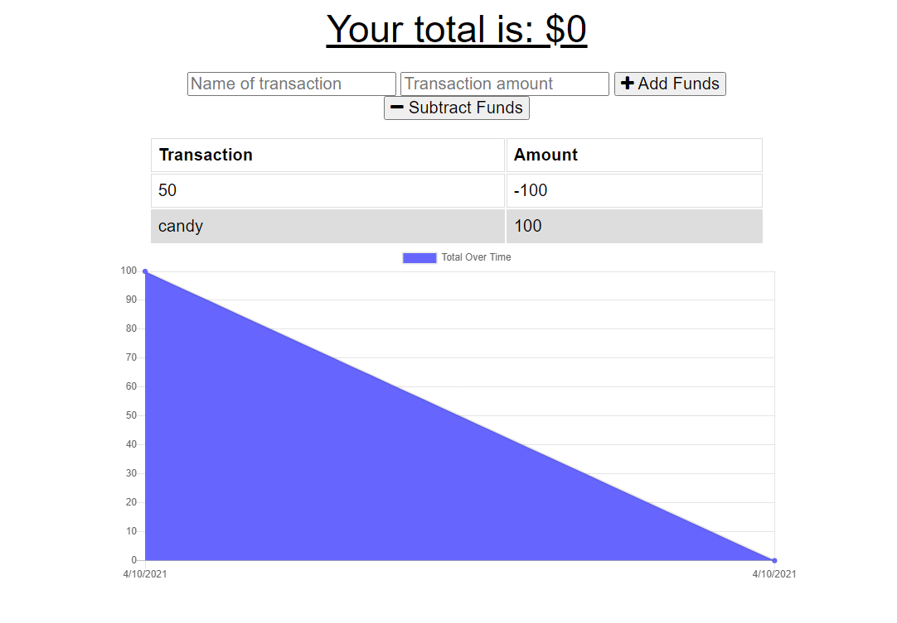

# Budget Tracker

## Description

This application is intended to organize a person's finances with simple to use features within the browser.

## Table of Contents

* [Features](#Features)
* [Links](#Links)
* [Screenshots](#Screenshots)
* [Language](#Language)
* [Code-Example](#Code-Example)
* [Reference](#Reference)
* [Tests/Issues/Notes](#Tests/Issues/Notes)
* [Contribute/Credits](#Contribute/Credits)
* [License](#License)

## Features

- [x] User can enter deposits and expenses online or offline.
- [x] User can add a budget.

## Links

* Project Repo: [Repository](https://github.com/Darrellfr3/PWA-Budget-Tracker)
* GitHub Page: [Website](https://jeishu.github.io/work-day-scheduler/)

## Screenshots

## Language

* JavaScript
* HTML
* CSS
* [jQuery](https://jquery.com/)
* [Mongoose](https://www.mongodb.com/)
* [Compression](https://github.com/expressjs/compression#readme)
* [Bootstrap](https://getbootstrap.com/)
* [Lite-Server](https://github.com/johnpapa/lite-server#readme)
